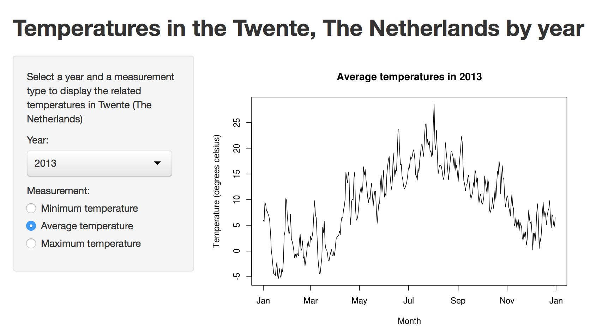

## Goals of the Shiny App

- Displaying a graph of temperatures in a given year in Twente, a location in The Netherlands
- Using a public data source of temperatures in The Netherlands
- Easy online access to the temperature data: https://underminer.shinyapps.io/temperatures/

--- .class #id 

## Data extraction and loading

Data is from the ROYAL NETHERLANDS METEOROLOGICAL INSTITUTE (KNMI): http://www.knmi.nl

The data was loaded and extracted using the following R-code:

```{r, eval=FALSE}
download.file("http://www.knmi.nl/klimatologie/daggegevens/datafiles3/290/etmgeg_290.zip", 
              "etmgeg_290.zip", method="curl")
unzip("etmgeg_290.zip")
weather <- read.csv("etmgeg_290.txt", skip=49)
weather[,42] <- NULL
names(weather) <- c("STN","YYYYMMDD","DDVEC","FHVEC","FG","FHX","FHXH",
                    "FHN","FHNH","FXX","FXXH","TG","TN","TNH","TX","TXH",
                    "T10N","T10NH","SQ","SP","Q","DR","RH","RHX","RHXH",
                    "PG","PX","PXH","PN","PNH","VVN","VVNH","VVX","VVXH",
                    "NG","UG","UX","UXH","UN","UNH","EV24")
```

--- .class #id 

## Data cleaning

We are only interested in the temperature columns (TG = average, TN = minimum, TX = maximum):

```{r, eval=FALSE}
temperatures <- weather[,c("YYYYMMDD", "TG", "TN", "TX")]
names(temperatures) <- c("date", "avg", "min", 'max')
# Temperatures are in 0.1 degrees Celsius, convert it to degrees Celsius
temperatures[,2:4] <- temperatures[,2:4] / 10
```

--- .class #id 

## The Shiny app

Input on the left, output on the right:

<!-- Limit image width and height -->
<style type="text/css">
img {     
  max-height: 500px;     
  max-width: 964px; 
}
</style>

